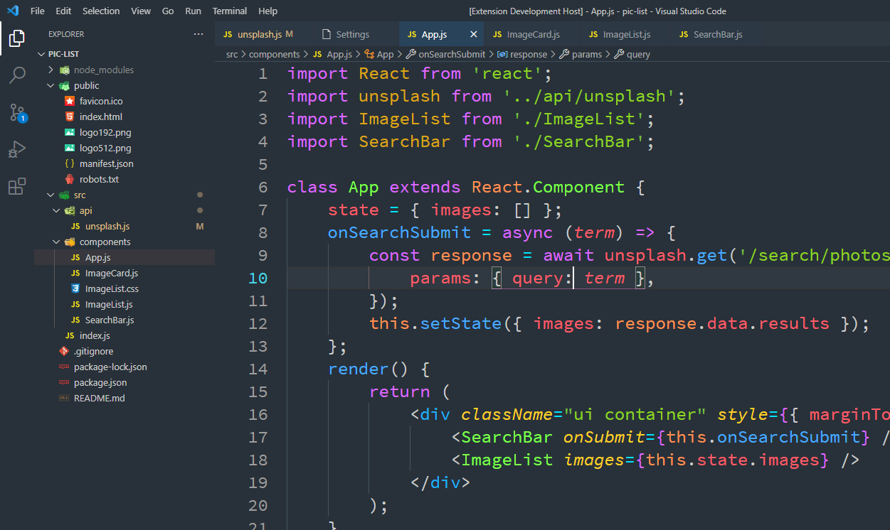

# KINN Theme for VS Code

   

# Installation

1. Open **Extensions** sidebar panel in VS Code. `View → Extensions`
2. Search for `KINN` - find the one by **Karen Chakhalyan** - there are a few other half-baked ones so make sure you have the right one!
3. Click **Install** to install it.
4. Code > Preferences > Color Theme > **KINN**
5. Optional: Use the recommended settings below for best experience

# Colors

| Name             | hex code  | Color                                                                    |
| ---------------- | --------- | ------------------------------------------------------------------------ |
| Blue Jeans       | `#48acff` |        |
| Sky Blue Crayola | `#00e3ff` |  |
| Cyber Yellow     | `#ffd325` |      |
| Atomic Tangerine | `#ff9252` |  |
| Fiery Rose       | `#ff5e6a` |        |
| Heliotrope       | `#dd69ff` |        |
| And more ...     |           |                                   |
